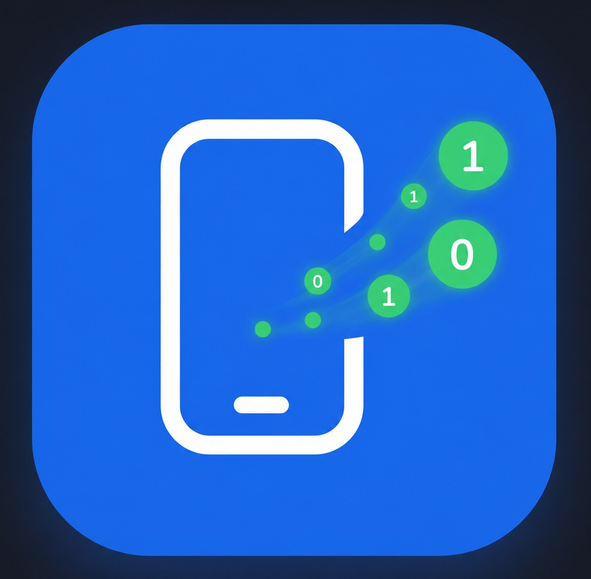

<p align="center">
  
</p>

<h1 align="center">DirectDrop</h1>

<p align="center">
  Transfer files from your phone to any PC over local Wi-Fi.<br>
  No cloud. No account. No PC app required.
</p>

<p align="center">
  <a href="DirectDrop_V0.39.apk"><strong>Download APK V0.39</strong></a>
  &nbsp;|&nbsp;
  <a href="CHANGELOG.md">Changelog</a>
</p>

---

## How it works

1. Open DirectDrop on your Android phone and select files.
2. The app starts a local HTTP server and shows a QR code.
3. Scan the QR code (or type the IP) on any PC browser in the same Wi-Fi network.
4. Download files individually or all at once as a ZIP.

No installation on the PC side. Works in any browser.

## Features

- **Phone to PC** - share photos, videos, documents, any files; per-file progress bar on both sides
- **PC to Phone** - upload one or multiple files from the PC browser to the phone
- **Download All as ZIP** - single click to get all files; streamed without compression for maximum speed
- **Android Share Target** - share files directly from gallery or file manager to DirectDrop
- **QR code** for instant connection; tap to copy the address
- **Dark / light theme** following system preference
- **10 languages**: Polish, English, Spanish, German, French, Portuguese, Arabic, Russian, Indonesian, Japanese
- **No cloud, no account, no tracking** - transfer stays entirely on your local network
- **~1.8 MB APK**, Android 8.0+ (API 26-36)

## Download

| Version | APK |
|---------|-----|
| V0.39 (latest) | [DirectDrop_V0.39.apk](DirectDrop_V0.39.apk) |

See [CHANGELOG.md](CHANGELOG.md) for full version history.

## Tech stack

- React + TypeScript + Vite (phone UI)
- Capacitor (Android bridge)
- NanoHTTPD (embedded HTTP server)
- ZipOutputStream with level 0 (no-compression ZIP streaming)

---

<details>
<summary>Design handoff / implementation notes</summary>
# Handoff: DirectDrop — PWA do przesyłania plików przez Wi‑Fi

> Working name: **DirectDrop**. Łatwy do rebrandingu (QuickDrop / WiFiDrop / LocalBeam / SnapTransfer) — nazwa marki jest jedną zmienną/stałą w kodzie, nie jest „wpalona" w UI.

---

## 1. Overview

DirectDrop to Progressive Web App (mobile‑first, Android‑first), która zamienia telefon w **tymczasowy lokalny serwer HTTP**. Użytkownik wybiera pliki na telefonie, aplikacja udostępnia je w sieci lokalnej, a dowolny komputer w tej samej sieci Wi‑Fi pobiera je przez przeglądarkę po zeskanowaniu kodu QR lub wpisaniu adresu IP. **Bez chmury, bez konta, bez instalacji po stronie PC.**

Cel UX: rozpoczęcie transferu w **mniej niż 10 sekund** od otwarcia aplikacji.

Paczka zawiera dwa widoki:
1. **Telefon (PWA)** — pełny flow nadawcy (5 ekranów).
2. **Komputer (strona pobierania)** — to, co widzi odbiorca w przeglądarce na PC.

---

## 2. About the Design Files

Pliki w katalogu `prototype/` to **referencje projektowe stworzone w HTML/React (Babel‑in‑browser)** — prototypy pokazujące docelowy wygląd i zachowanie. **Nie są to pliki produkcyjne do skopiowania 1:1.**

Zadanie dla Claude Code: **odtworzyć te projekty w docelowym środowisku** (np. React + Vite jako PWA, Next.js, Vue, SvelteKit, lub natywny Android — zależnie od tego, co istnieje w repo). Jeśli repo jest puste, rekomendowany stack: **React + TypeScript + Vite + PWA (vite‑plugin‑pwa)**, ponieważ prototyp jest już w React, a docelowa apka jest PWA.

Część serwerowa (faktyczny serwer HTTP na telefonie, generowanie IP/portu, strumieniowanie plików) **nie jest** w prototypie — prototyp **symuluje** transfer. Do produkcji potrzebny jest realny backend (np. WebRTC / lokalny serwer HTTP przez `WebTransport`/`http-server` w środowisku natywnym, albo Service Worker + `showSaveFilePicker`). To decyzja architektoniczna poza zakresem makiety — makieta definiuje wyłącznie warstwę UI/UX.

---

## 3. Fidelity

**High‑fidelity (hifi).** Finalne kolory, typografia, odstępy, zaokrąglenia, cienie i interakcje. Odtwarzaj UI pixel‑perfect, używając bibliotek/komponentów istniejących w docelowym repo. Wszystkie wartości (hex, px, font‑weight) są wypisane niżej w **Design Tokens** i przy każdym komponencie.

---

## 4. Architektura informacji / nawigacja

Aplikacja to maszyna stanów z jedną zmienną `screen` (widok telefonu) i przełącznikiem `view` (telefon ↔ komputer).

```
view = 'phone' | 'desktop'        // przełącznik na górnym pasku sceny (demo)
screen = 'home' | 'selection' | 'sharing' | 'completed'   // tylko gdy view==='phone'
theme = 'light' | 'dark'
```

Flow telefonu:
```
home ──(Wybierz pliki)──▶ selection ──(Udostępnij)──▶ sharing
                              ▲                            │
                              │                  (wszystkie pliki done, +1.5s)
                              │                            ▼
   completed ◀───────────────┴─────────────────────── completed
     │  └─(Udostępnij kolejne)─▶ selection
     └────(Zamknij sesję)──────▶ home
   sharing ──(Zatrzymaj udostępnianie)──▶ home
```

> Uwaga: w prototypie górny pasek „Telefon / Komputer" oraz przełącznik motywu to **rusztowanie prezentacyjne** (scena demo), a NIE część właściwej apki. W produkcji: widok telefonu = sama PWA; widok komputera = osobna strona serwowana przez telefon. Motyw przełączaj wg `prefers-color-scheme` + opcjonalny toggle w ustawieniach.

---

## 5. Design Tokens

### 5.1 Kolory — Light (domyślny)
| Token | Hex | Użycie |
|---|---|---|
| `--accent` | `#1f6feb` | Kolor wiodący (przyciski primary, postęp, linki). Zmienny w Tweaks. |
| `--screen` | `#fbfaf7` | Tło ekranu telefonu / strony |
| `--screen-2` | `#f4f1ea` | Tło paska przeglądarki, drugorzędne tło |
| `--card` | `#ffffff` | Tło kart |
| `--card-2` | `#f7f4ee` | Tło wtórne (statystyki, pola, ikon‑buttony) |
| `--ink` | `#1c1a15` | Tekst główny (ciepła czerń) |
| `--ink-2` | `#6f6a5f` | Tekst drugorzędny |
| `--ink-3` | `#a39d8f` | Tekst trzeciorzędny / placeholdery |
| `--line` | `#ece7dc` | Obramowania (1px inset) |
| `--line-2` | `#e3ddd0` | Mocniejsze obramowania |
| `--success` | `#1f9d57` | „Udostępnianie aktywne", zakończone transfery |
| `--danger` | `#e0524f` | „Zatrzymaj udostępnianie" |
| `--amber` | `#d98a23` | Stan „Oczekiwanie" |

### 5.2 Kolory — Dark
| Token | Hex |
|---|---|
| `--screen` | `#16171c` |
| `--screen-2` | `#1b1d23` |
| `--card` | `#1f2128` |
| `--card-2` | `#262932` |
| `--ink` | `#f3f1ea` |
| `--ink-2` | `#a8a49a` |
| `--ink-3` | `#6f6d66` |
| `--line` | `rgba(255,255,255,.075)` |
| `--line-2` | `rgba(255,255,255,.12)` |
| `--success` | `#3ec27a` |
| `--danger` | `#f0716e` |
| `--amber` | `#e7a64a` |

### 5.3 Kolory pochodne (CSS `color-mix`)
Generowane z `--accent` / stanów, by automatycznie podążać za zmianą akcentu (Tweaks) i motywem:
```
--accent-soft   = color-mix(in srgb, var(--accent) 11%, var(--card))   /* light; dark: 22% */
--accent-line   = color-mix(in srgb, var(--accent) 24%, var(--card))   /* light; dark: 40% */
--success-soft  = color-mix(in srgb, var(--success) 13%, var(--card))  /* light; dark: 20% */
--danger-soft   = color-mix(in srgb, var(--danger) 13%, var(--card))   /* light; dark: 20% */
--amber-soft    = color-mix(in srgb, var(--amber) 15%, var(--card))    /* light; dark: 22% */
```

### 5.4 Ikony typów plików (kolorowe kafelki)
Tinty generowane w OKLCH wg „hue" typu pliku. `.fic` = 48×48 (lub 40/46), `border-radius:14px`.
| Typ | hue | Light tło / ikona | Dark tło / ikona |
|---|---|---|---|
| video | 266 | `oklch(.93 .06 266)` / `oklch(.52 .16 266)` | `oklch(.32 .05 266)` / `oklch(.82 .12 266)` |
| image | 28 | jw. z hue 28 | jw. |
| map (gpx) | 150 | hue 150 | jw. |
| music | 332 | hue 332 | jw. |
| doc | 212 | hue 212 | jw. |
| file (inne) | 212 | hue 212 | jw. |
Wzór: `bg = oklch(0.93 0.06 H)`, `fg = oklch(0.52 0.16 H)` (light); `bg = oklch(0.32 0.05 H)`, `fg = oklch(0.82 0.12 H)` (dark).

### 5.5 Typografia
- **Font główny:** `Plus Jakarta Sans` (Google Fonts), wagi 400/500/600/700/800. Geometryczny, przyjazny.
- **Font monospace:** `JetBrains Mono`, wagi 400/500/600. Używany dla: adres IP, rozmiary/prędkości (MB/s), wartości procentowe, statystyki liczbowe.
- Skala (px / weight / letter‑spacing):
  | Klasa | size | weight | l‑spacing | line‑height |
  |---|---|---|---|---|
  | `.h1` | 30 | 800 | -.03em | 1.08 |
  | `.h2` | 21 | 800 | -.02em | — |
  | `.eyebrow` | 12 | 700 | .12em UPPERCASE | — |
  | tekst body | 15–15.5 | 500 | — | 1.5 |
  | label/secondary | 13–13.5 | 500–600 | — | — |
  | `.stat .v` | 20 | 800 (mono) | -.02em | — |
  | `.stat .k` | 11.5 | 600 | — | — |
  | przycisk `.btn` | 16 | 700 | -.01em | — |

### 5.6 Promienie, cienie, odstępy
```
--radius-card: 26px    (karty)
--radius-btn:  16px    (przyciski)
--radius-sm:   12px    (drobne)
ikon‑button:   13px    (42×42)
file row:      18px
chip / pill:   999px
qr box:        24px (duży), 16px (kompaktowy)
phone frame:   44px (zewn.), 38px (ekran)

--shadow:    0 1px 2px rgba(40,33,20,.04), 0 8px 24px rgba(40,33,20,.06)
--shadow-lg: 0 24px 60px rgba(40,33,20,.14)
(dark: cienie czarne, mocniejsze — patrz CSS)
przycisk primary: 0 6px 18px color-mix(in srgb, var(--accent) 38%, transparent)

Odstępy: padding ekranów 18–28px; gap list 10px; gap sekcji 14–20px.
```

### 5.7 Wymiary ramki telefonu (prototyp / scena)
- Ramka: 404×812px, padding 9px, gradient bezel `linear-gradient(160deg,#3a3a3a,#101010)`.
- Pasek statusu: wysokość 44px (zegar 9:30, „punch‑hole" kamery, ikony Wi‑Fi+bateria).
- Pasek nawigacji (pill gestów): 26px.
- W produkcji to **nie** jest częścią apki — apka wypełnia cały viewport telefonu.

---

## 6. Screens / Views (Telefon)

### 6.1 Home (`screen='home'`)
- **Cel:** punkt startu; jedno główne działanie.
- **Layout:** kolumna, padding `28px 24px 120px`. Góra: logo + nazwa „DirectDrop" po lewej, chip „🛡 Lokalnie" po prawej. Środek (flex, justify‑center): karta hero. Dół: pasek przycisków przyklejony (`.bottombar`, gradient z tła).
- **Karta hero** (`.card`, padding `30px 26px`, text‑center, radial‑gradient akcentu od góry):
  - Ilustracja „beam": kafelek **Telefon** (62×62, tło `--accent`, ikona telefonu biała) — 3 pulsujące kropki akcentu (animacja `beam`) — kafelek **PC** (62×62, tło `--card-2`, ikona monitora).
  - H1: „Wyślij pliki / prosto na komputer" (`.h1`).
  - Opis (`.muted`, 15.5px, max‑width 300px): „Twój telefon staje się serwerem. Pobieranie przez przeglądarkę w tej samej sieci Wi‑Fi — bez chmury i kabli."
- **Feature chips** (3, wyśrodkowane): „⚡ Duże pliki", „🛡 Bez konta", „📶 Tylko Wi‑Fi" (ikony line, nie emoji).
- **CTA:**
  - Primary `Button` block, ikona `upload`: **„Wybierz pliki"** → otwiera systemowy `<input type="file" multiple>`; po wyborze (lub w demo: zestaw przykładowy) → `selection`.
  - Secondary block, ikona `folder`, **disabled**: **„Wybierz folder"** + badge „Wkrótce" (pill akcentu).

### 6.2 Selection (`screen='selection'`)
- **Cel:** przegląd i edycja listy plików przed udostępnieniem.
- **Layout:** padding `20px 20px 150px`. Header: ikon‑button „wstecz" + tytuł „Wybrane pliki" (`.h2`) z podtytułem „N plików · ROZMIAR" + ikon‑button „plus" (dodaj). Lista kart plików (gap 10). Ghost‑button „+ Dodaj więcej plików". Dół: `.bottombar` z „Łącznie / ROZMIAR" (mono, 22px) + primary `Button` „Udostępnij" (ikona `wifi`, ikona‑po `arrowR`), disabled gdy lista pusta.
- **File row** (`.frow`, padding `13px 14px`, radius 18, `box-shadow: inset 0 0 0 1px var(--line)`):
  - Kolorowa ikona typu (48×48) | nazwa (700/15px, ellipsis) + rozmiar (`.muted` 13px) | ikon‑button „x" (36×36) usuwa plik.

### 6.3 Sharing (`screen='sharing'`) — NAJWAŻNIEJSZY EKRAN
Dwa stany, zależne od `showActivity` (= czy podłączył się PC i ruszył transfer):

**A) Oczekiwanie (`!showActivity`):**
- Status pill „🟢 Udostępnianie aktywne" (`.pill--success.pill--live`, pulsująca kropka) + ikon‑button „monitor" (podgląd strony PC) po prawej.
- **Duża karta QR** (`.card`, text‑center): eyebrow „ZESKANUJ TELEFONEM LUB WPISZ ADRES" → biały `.qrbox` (radius 24, padding 20) z **kodem QR 188×188** → pasek adresu `.addr`: ikona `link` + `http`‑less URL (mono 15px) + kwadratowy przycisk Kopiuj (40×40, ikona `copy`→`check`). Po kopiowaniu: „Skopiowano do schowka" (success).
- Rząd **statystyk** (3× `.stat`): liczba plików / rozmiar / liczba urządzeń.
- Karta „**Oczekiwanie na komputer…**" (ikona amber pulsująca) + „Otwórz adres w przeglądarce na PC" + przycisk **„Symuluj"** (ręcznie wymusza połączenie — w produkcji zbędny, połączenie wykrywane realnie).

**B) Aktywny transfer (`showActivity`):**
- Status pill jw.
- **Kompaktowy pasek udostępniania** (`.card`, padding 14, flex): mały `.qrbox` (62×62) | URL (mono 14.5) + „N urządzeń połączonych" (z ikoną monitor) | ikon‑button Kopiuj.
- **Karta postępu łącznego** (`.card`): „Przesyłanie… / Zakończono" + procent (mono 16, akcent/success) → `ProgressBar` → „X z N plików" + „PRZESŁANE / CAŁOŚĆ" (mono).
- Sekcja **„TRANSFERY NA ŻYWO"** (eyebrow) + pill „🟢 na żywo" → lista `TransferRow`.
- **`TransferRow`** (`.card`, padding `14px 15px`): ikona typu (40) + nazwa + „przesłane / rozmiar" + procent (mono, success gdy done) → `ProgressBar` → stopka: prędkość „⚡ 33 MB/s" (akcent) **lub** „✓ Zakończono" (success), oraz ETA „🕐 12 s" (`.muted`).
- Dół: `.bottombar` z `Button--danger` block „⏹ Zatrzymaj udostępnianie".

### 6.4 Completed (`screen='completed'`)
- **Cel:** potwierdzenie + statystyki + dalsze kroki.
- **Layout:** kolumna wyśrodkowana, padding `24px 24px 130px`.
  - `.checkring`: koło 108px (success‑soft) z dwoma rozchodzącymi się pierścieniami (`::before`/`::after`, opacity .18/.08) + rdzeń 72px (success) z ikoną `check` (biała), animacja `pop` (sprężysta).
  - H1 „Przesłano!" + opis „Wszystkie pliki zostały pobrane na komputer w sieci lokalnej."
  - Karta statystyk (3× przezroczyste `.stat`): liczba plików / „ROZMIAR przesłano" / „MB/s średnio".
  - Chip „🕐 Czas: 17 s".
  - `.bottombar`: primary „⬆ Udostępnij kolejne pliki" (→ selection) + secondary „Zamknij sesję" (→ home).

---

## 7. Desktop Download Page (`view='desktop'`)
To, co widzi odbiorca w przeglądarce PC po wejściu na adres telefonu. W prototypie owinięte w atrapę okna przeglądarki (`.browser`, 1060×712, radius 16) — w produkcji to zwykła responsywna strona.

- **Pasek przeglądarki:** 3 światła (`#ec6a5e`/`#f4be4f`/`#61c454`) + pole URL (mono, ikona kłódki success + `192.168.1.123:8080`).
- **Treść** (`.dl-wrap`, max‑width 720, padding `48px 32px 56px`):
  - Header: logo (46) + „Pliki z telefonu" (26/800) + „📱 Pixel 8 Pro · N plików · ROZMIAR" (mono) + pill „🟢 Połączono".
  - **Karta „Pobierz wszystko jako ZIP"** (tło `--accent-soft`, obwódka `--accent-line`): ikona zip (46, tło akcent) + opis + `Button--primary` „⬇ Pobierz wszystko" → uruchamia pobieranie wszystkich.
  - **Lista plików** (`.card` każdy, padding `14px 18px`): ikona typu (46) + nazwa (15.5/700) + (rozmiar **lub** `ProgressBar` gdy trwa) + po prawej: `Button--secondary` „⬇ Pobierz" → po kliknięciu animowany postęp → pill „✓ Pobrano" (success).
  - Stopka: „🛡 Transfer odbywa się wyłącznie w Twojej sieci lokalnej. Nic nie trafia do chmury."

---

## 8. Interactions & Behavior

- **Wybór plików:** systemowy `<input type="file" multiple>`; odczyt `name` + `size`. (W prototypie alternatywnie ładowany zestaw demo.) Typ pliku rozpoznawany po rozszerzeniu — patrz `extType()` w `ui.jsx`.
- **Symulacja transferu (prototyp):** po wejściu w `sharing`, po **1.8s** auto‑„łączy się" PC (`doConnect`): `clients=1`, toast „PC‑DESKTOP połączony". Każdy plik dostaje `dur` (czas) `= clamp(rozmiarMB / 90, 1.2s, 9s)` i `delay = index*0.45s`. Pętla `requestAnimationFrame` liczy `progress = (elapsed/dur)*100`, `speed = rozmiarMB/dur * jitter(0.85–1.15)`, `eta = (1-progress)*dur`. Gdy wszystkie `done` → po **1.5s** przejście do `completed` (liczone realne `duration` i `avg = totalMB/duration`).
  - **W produkcji:** zastąp symulację realnymi zdarzeniami serwera (nowe połączenie, bajty wysłane na plik). UI/teksty/animacje zostają identyczne; podmieniasz tylko źródło danych `progress/speed/eta/clients`.
- **Kopiowanie adresu:** `navigator.clipboard.writeText(address)`; stan `copied` na 1.8s (ikona `copy`→`check`).
- **Toast:** wjeżdża z góry (`toastIn`, translateY‑only), znika po 2.6s.
- **Animacje** (wszystkie gate'owane tak, by zamrożona/redukowana klatka pokazywała treść — patrz §10):
  | Nazwa | Czas / easing | Co robi |
  |---|---|---|
  | `viewIn` | .42s cubic-bezier(.22,1,.36,1) | wejście ekranu, **tylko translateY(10px)→0** |
  | `pop` | .5s cubic-bezier(.34,1.56,.64,1) | sprężyste skalowanie rdzenia check (scale .5→1) |
  | `livePulse` | 1.4s loop | puls kropki „live"/oczekiwania (box‑shadow) |
  | `beam` | 1.2s loop, stagger .18s | 3 kropki na home |
  | `toastIn` | .4s | wjazd toasta (translateY) |
  | `ProgressBar > i` | width transition .25s linear | płynny postęp |
- **Hover/active:** `.btn:active{scale .975}`; primary hover `brightness(1.05)`; ikon‑button hover przyciemnienie tła, active `scale .92`.

---

## 9. State Management
Zmienne (w prototypie `useState`/`useRef` w `app.jsx`):
```
view: 'phone'|'desktop'          // przełącznik sceny demo (w prod: routing/oddzielne apki)
screen: 'home'|'selection'|'sharing'|'completed'
theme/dark: boolean              // prefers-color-scheme + toggle
files: Array<{ id, name, size(bytes), type, progress(0-100), status, speed, eta }>
                                  // status: 'queued'|'active'|'done'
clients: number                  // liczba połączonych PC
connected: boolean               // czy ruszył transfer
copied: boolean                  // feedback kopiowania
toast: { icon, title, sub } | null
stats: { duration(s), avg(MB/s) } // wyliczane na completed
accent: hex                      // Tweak (kolor wiodący)
```
Refy pomocnicze (symulacja): `connectTime` (timestamp), `durs` (mapa id→{dur,delay,jitter}), `filesRef` (zawsze aktualna lista — by uniknąć stale closure).

Trwałość: `view` i `dark` zapisywane w `localStorage` (klucz `directdrop_v1`). W produkcji: zapamiętuj motyw i ewentualnie ostatnią sesję.

---

## 10. Dostępność / odporność (WAŻNE)
- **Animacje wejścia nie mogą chować treści.** Stan bazowy = widoczny; animuje się **tylko transform** (nigdy `opacity:0` jako stan bazowy). Dzięki temu druk, `prefers-reduced-motion` i zatrzymana klatka pokazują treść. Dodatkowo `@media (prefers-reduced-motion: reduce){ .view-anim{animation:none} }`.
- Hit‑targety ≥ 44px (przyciski 54px, ikon‑buttony 42px).
- Kontrast tekstu zgodny z ciepłą paletą; akcent `#1f6feb` na bieli i na ciemnym tle.
- Teksty PL — patrz dokładne kopie przy ekranach (sekcja 6–7).

---

## 11. Assets
- **Fonty:** Google Fonts — `Plus Jakarta Sans` (400–800) + `JetBrains Mono` (400–600). W produkcji: self‑host lub `@fontsource`.
- **Kod QR:** generowany realnie z adresu biblioteką **`qrcode-generator`** (`qrcode(0,'M')`, `addData`, `isDark`). W prototypie rysowany jako SVG z zaokrąglonymi modułami + 3 „oczy" jako rounded‑squares (`QR` w `ui.jsx`). W produkcji użyj dowolnej lib QR (`qrcode`, `qrcode.react`).
- **Ikony:** własny zestaw **line icons** (SVG, stroke 2, 24×24) w `ui.jsx` → komponent `Icon({name})`. Nazwy: upload, folder, arrowR, chevR, back, plus, x, copy, check, stop, wifi, monitor, phone, shield, download, zip, video, image, map, music, file, doc, bolt, clock, refresh, sun, moon, qr, link, users. W produkcji można zastąpić istniejącą biblioteką ikon (Lucide ma odpowiedniki 1:1).
- **Logo:** prosty znak `LogoMark` — zaokrąglony kwadrat w kolorze akcentu z białą strzałką „upload" (3 ścieżki SVG). Placeholder pod finalne logo marki.
- **Brak rastrowych assetów** — wszystko wektorowe/CSS.
- **Dane demo:** 5 plików (video001.mp4 1.24 GB, sunset_timelapse.mov 148 MB, IMG_4821.jpg 5.1 MB, IMG_4822.jpg 4.6 MB, ride_2026‑06‑13.gpx 842 KB) — tylko do prezentacji.

---

## 11.1 Screenshots (katalog `screenshots/`)
Renderowane referencje wizualne (hifi) — każdy ekran/stan, light + dark:
| Plik | Co pokazuje |
|---|---|
| `01-home-light.png` | Ekran Home (light) |
| `02-selection.png` | Wybór plików — lista + „Łącznie" + CTA |
| `03-sharing-qr.png` | Udostępnianie — duży QR + adres + statystyki + toast „PC połączony" |
| `04-sharing-active.png` | Transfer na żywo — kompaktowy pasek + postęp łączny + `TransferRow` (prędkość, %, ETA) |
| `05-completed.png` | Ekran „Przesłano!" ze statystykami (light) |
| `06-home-dark.png` | Ekran Home (dark) — paleta ciemna |
| `07-desktop.png` | Strona pobierania na PC — stany: pobieranie / „Pobrano" / „Pobierz" |

> Górny pasek „Telefon / Komputer" i przełącznik motywu na zrzutach to scena demo — nie część produkcyjnej apki (patrz §4).

## 12. Files (w tej paczce, katalog `prototype/`)
| Plik | Zawartość |
|---|---|
| `DirectDrop.html` | Shell: wszystkie design tokens w `<style>` (light+dark), importy React/Babel/QR, font‑linki. **Tu jest cały CSS systemu.** |
| `ui.jsx` | Prymitywy: `Icon`, `FileIcon`, `Button`, `QR`, `ProgressBar`, `LogoMark` + helpery `formatBytes/formatSpeed/formatTime`, `extType`. |
| `screens.jsx` | Ekrany telefonu: `HomeScreen`, `SelectionScreen`, `SharingScreen`, `TransferRow`, `CompletedScreen`. |
| `app.jsx` | Root: maszyna stanów, symulacja transferu, `DesktopPage` + `DesktopFileRow`, scena (pasek Telefon/Komputer, motyw), panel Tweaks. |
| `tweaks-panel.jsx` | Komponent panelu Tweaks (rusztowanie prototypu — **pomiń w produkcji**). |

### Jak uruchomić prototyp lokalnie
Otwórz `prototype/DirectDrop.html` w przeglądarce (wymaga internetu — fonty/React/QR z CDN). To referencja wizualna; nie jest to docelowy build.

---

## 13. Rekomendowane kroki implementacji (dla Claude Code)
1. Załóż projekt **React + TS + Vite + PWA** (jeśli repo puste). Skonfiguruj manifest PWA (nazwa „DirectDrop", ikona, theme‑color = `#1f6feb`, display `standalone`).
2. Przenieś **design tokens** z `<style>` w `DirectDrop.html` do warstwy stylów repo (CSS variables / Tailwind config / styled). Zachowaj light+dark i pochodne `color-mix`.
3. Odtwórz **prymitywy** (`Button`, `Card`, `Pill`, `ProgressBar`, `FileIcon`, `Icon`) komponentami repo / istniejącej biblioteki.
4. Zbuduj ekrany 6.1–6.4 + stronę 7 wg opisów (kopie PL dokładnie jak wyżej).
5. Podłącz **realny backend transferu** zamiast symulacji z §8; UI konsumuje `progress/speed/eta/clients` z prawdziwych zdarzeń.
6. Zachowaj zasady z §10 (animacje nie chowają treści, reduced‑motion, hit‑targety).
7. Marka jako jedna stała `BRAND_NAME` (łatwy rebranding).

— Koniec —

</details>
