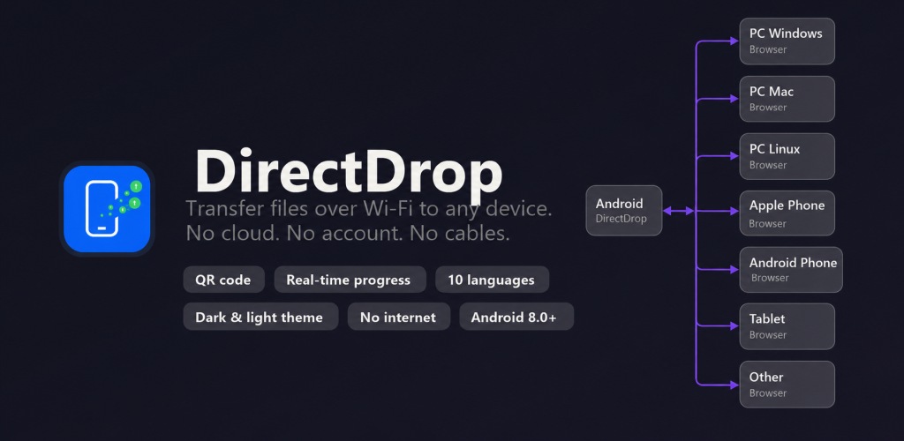

<p align="center">
  
</p>

<h1 align="center">DirectDrop</h1>

<p align="center">
  Transfer files between your phone and any device over local Wi-Fi.<br>
  No cloud. No account. No app required on the other side.
</p>

<p align="center">
  
</p>

<p align="center">
  <a href="https://play.google.com/store/apps/details?id=app.spotrobotics.directdrop"><strong>Google Play</strong></a>
  &nbsp;|&nbsp;
  <a href="DirectDrop_V0.53.apk"><strong>APK V0.53 (sideload)</strong></a>
  &nbsp;|&nbsp;
  <a href="CHANGELOG.md">Changelog</a>
  &nbsp;|&nbsp;
  <a href="https://spotrobotics.app/directdrop/">Presentation page</a>
</p>

---

## How it works

**Phone to PC:**
1. Open DirectDrop on your Android phone and select files.
2. The app starts a local HTTP server and shows a QR code.
3. Scan the QR code (or type the IP) on any browser in the same Wi-Fi network.
4. Download files individually or all at once as a ZIP.

**PC to Phone:**
- Use the upload area in the browser to send files from any device to your phone.

No installation on the receiving side. Works in any browser.

## Features

- **Phone to PC** - share photos, videos, documents, any files; per-file progress bar on both sides
- **PC to Phone** - upload one or multiple files from the PC browser to the phone
- **Download All as ZIP** - single click to get all files; streamed without compression for maximum speed
- **Android Share Target** - share files directly from gallery or file manager to DirectDrop
- **QR code** for instant connection; tap to copy the address
- **Dark / light theme** following system preference
- **10 languages**: Polish, English, Spanish, German, French, Portuguese, Arabic, Russian, Indonesian, Japanese
- **No cloud, no account, no tracking** - transfer stays entirely on your local network
- **~1.5 MB APK**, Android 8.0+ (API 26-36)

## Download

| Version | APK |
|---------|-----|
| V0.53 (latest) | [DirectDrop_V0.53.apk](DirectDrop_V0.53.apk) |
| V0.39 | [DirectDrop_V0.39.apk](DirectDrop_V0.39.apk) |

See [CHANGELOG.md](CHANGELOG.md) for full version history.

## Tech stack

- React + TypeScript + Vite (phone UI)
- Capacitor (Android bridge)
- NanoHTTPD (embedded HTTP server)
- ZipOutputStream with level 0 (no-compression ZIP streaming)

---

<details>
<summary>Design handoff / implementation notes</summary>
# Handoff: DirectDrop — PWA for sending files over Wi-Fi

> Working name: **DirectDrop**. Easy to rebrand (QuickDrop / WiFiDrop / LocalBeam / SnapTransfer) — the brand name is a single variable/constant in the code, not "baked into" the UI.

---

## 1. Overview

DirectDrop is a Progressive Web App (mobile-first, Android-first) that turns a phone into a **temporary local HTTP server**. The user picks files on the phone, the app shares them on the local network, and any computer on the same Wi-Fi network downloads them through the browser after scanning a QR code or typing the IP address. **No cloud, no account, no install on the PC side.**

UX goal: start a transfer in **under 10 seconds** from opening the app.

The package contains two views:
1. **Phone (PWA)** — full sender flow (5 screens).
2. **Computer (download page)** — what the recipient sees in a PC browser.

---

## 2. About the Design Files

The files in the `prototype/` directory are **design references built in HTML/React (Babel-in-browser)** — prototypes showing the target look and behavior. **They are not production files to be copied 1:1.**

Task for Claude Code: **rebuild these designs in the target stack** (e.g. React + Vite as a PWA, Next.js, Vue, SvelteKit, or native Android — depending on what's already in the repo). If the repo is empty, the recommended stack is **React + TypeScript + Vite + PWA (vite-plugin-pwa)**, since the prototype is already in React and the target app is a PWA.

The server side (the actual HTTP server on the phone, IP/port generation, file streaming) is **not** in the prototype — the prototype **simulates** the transfer. Production needs a real backend (e.g. WebRTC / a local HTTP server via `WebTransport`/`http-server` in a native environment, or a Service Worker + `showSaveFilePicker`). That's an architectural decision outside the scope of the mockup — the mockup defines only the UI/UX layer.

---

## 3. Fidelity

**High-fidelity (hifi).** Final colors, typography, spacing, corner radii, shadows, and interactions. Reproduce the UI pixel-perfect, using the libraries/components already in the target repo. All values (hex, px, font-weight) are listed below under **Design Tokens** and next to each component.

---

## 4. Information architecture / navigation

The app is a state machine with one `screen` variable (phone view) and a `view` switch (phone ↔ computer).

```
view = 'phone' | 'desktop'        // switch on the top demo-scene bar
screen = 'home' | 'selection' | 'sharing' | 'completed'   // only when view==='phone'
theme = 'light' | 'dark'
```

Phone flow:
```
home ──(Select files)──▶ selection ──(Share)──▶ sharing
                              ▲                            │
                              │                  (all files done, +1.5s)
                              │                            ▼
   completed ◀───────────────┴─────────────────────── completed
     │  └─(Share more files)─▶ selection
     └────(Close session)──────▶ home
   sharing ──(Stop sharing)──▶ home
```

> Note: in the prototype, the top "Phone / Computer" bar and the theme toggle are **presentation scaffolding** (demo scene), NOT part of the actual app. In production: phone view = the PWA itself; computer view = a separate page served by the phone. Switch theme based on `prefers-color-scheme` + an optional toggle in settings.

---

## 5. Design Tokens

### 5.1 Colors — Light (default)
| Token | Hex | Usage |
|---|---|---|
| `--accent` | `#1f6feb` | Lead color (primary buttons, progress, links). Variable in Tweaks. |
| `--screen` | `#fbfaf7` | Phone screen / page background |
| `--screen-2` | `#f4f1ea` | Browser bar background, secondary background |
| `--card` | `#ffffff` | Card background |
| `--card-2` | `#f7f4ee` | Secondary background (stats, fields, icon-buttons) |
| `--ink` | `#1c1a15` | Primary text (warm black) |
| `--ink-2` | `#6f6a5f` | Secondary text |
| `--ink-3` | `#a39d8f` | Tertiary text / placeholders |
| `--line` | `#ece7dc` | Borders (1px inset) |
| `--line-2` | `#e3ddd0` | Stronger borders |
| `--success` | `#1f9d57` | "Sharing active", completed transfers |
| `--danger` | `#e0524f` | "Stop sharing" |
| `--amber` | `#d98a23` | "Waiting" state |

### 5.2 Colors — Dark
| Token | Hex |
|---|---|
| `--screen` | `#16171c` |
| `--screen-2` | `#1b1d23` |
| `--card` | `#1f2128` |
| `--card-2` | `#262932` |
| `--ink` | `#f3f1ea` |
| `--ink-2` | `#a8a49a` |
| `--ink-3` | `#6f6d66` |
| `--line` | `rgba(255,255,255,.075)` |
| `--line-2` | `rgba(255,255,255,.12)` |
| `--success` | `#3ec27a` |
| `--danger` | `#f0716e` |
| `--amber` | `#e7a64a` |

### 5.3 Derived colors (CSS `color-mix`)
Generated from `--accent` / states, so they automatically follow accent changes (Tweaks) and theme:
```
--accent-soft   = color-mix(in srgb, var(--accent) 11%, var(--card))   /* light; dark: 22% */
--accent-line   = color-mix(in srgb, var(--accent) 24%, var(--card))   /* light; dark: 40% */
--success-soft  = color-mix(in srgb, var(--success) 13%, var(--card))  /* light; dark: 20% */
--danger-soft   = color-mix(in srgb, var(--danger) 13%, var(--card))   /* light; dark: 20% */
--amber-soft    = color-mix(in srgb, var(--amber) 15%, var(--card))    /* light; dark: 22% */
```

### 5.4 File type icons (colored tiles)
Tints generated in OKLCH based on the file type's "hue". `.fic` = 48×48 (or 40/46), `border-radius:14px`.
| Type | hue | Light bg / icon | Dark bg / icon |
|---|---|---|---|
| video | 266 | `oklch(.93 .06 266)` / `oklch(.52 .16 266)` | `oklch(.32 .05 266)` / `oklch(.82 .12 266)` |
| image | 28 | same, hue 28 | same |
| map (gpx) | 150 | hue 150 | same |
| music | 332 | hue 332 | same |
| doc | 212 | hue 212 | same |
| file (other) | 212 | hue 212 | same |
Formula: `bg = oklch(0.93 0.06 H)`, `fg = oklch(0.52 0.16 H)` (light); `bg = oklch(0.32 0.05 H)`, `fg = oklch(0.82 0.12 H)` (dark).

### 5.5 Typography
- **Primary font:** `Plus Jakarta Sans` (Google Fonts), weights 400/500/600/700/800. Geometric, friendly.
- **Monospace font:** `JetBrains Mono`, weights 400/500/600. Used for: IP address, sizes/speeds (MB/s), percentage values, numeric stats.
- Scale (px / weight / letter-spacing):
  | Class | size | weight | l-spacing | line-height |
  |---|---|---|---|---|
  | `.h1` | 30 | 800 | -.03em | 1.08 |
  | `.h2` | 21 | 800 | -.02em | — |
  | `.eyebrow` | 12 | 700 | .12em UPPERCASE | — |
  | body text | 15–15.5 | 500 | — | 1.5 |
  | label/secondary | 13–13.5 | 500–600 | — | — |
  | `.stat .v` | 20 | 800 (mono) | -.02em | — |
  | `.stat .k` | 11.5 | 600 | — | — |
  | `.btn` button | 16 | 700 | -.01em | — |

### 5.6 Radii, shadows, spacing
```
--radius-card: 26px    (cards)
--radius-btn:  16px    (buttons)
--radius-sm:   12px    (small elements)
icon-button:   13px    (42×42)
file row:      18px
chip / pill:   999px
qr box:        24px (large), 16px (compact)
phone frame:   44px (outer), 38px (screen)

--shadow:    0 1px 2px rgba(40,33,20,.04), 0 8px 24px rgba(40,33,20,.06)
--shadow-lg: 0 24px 60px rgba(40,33,20,.14)
(dark: black shadows, stronger — see CSS)
primary button: 0 6px 18px color-mix(in srgb, var(--accent) 38%, transparent)

Spacing: screen padding 18–28px; list gap 10px; section gap 14–20px.
```

### 5.7 Phone frame dimensions (prototype / scene)
- Frame: 404×812px, padding 9px, bezel gradient `linear-gradient(160deg,#3a3a3a,#101010)`.
- Status bar: height 44px (clock 9:30, camera "punch-hole", Wi-Fi+battery icons).
- Navigation bar (gesture pill): 26px.
- In production this is **not** part of the app — the app fills the entire phone viewport.

---

## 6. Screens / Views (Phone)

### 6.1 Home (`screen='home'`)
- **Goal:** starting point; one main action.
- **Layout:** column, padding `28px 24px 120px`. Top: logo + "DirectDrop" name on the left, "🛡 Local" chip on the right. Middle (flex, justify-center): hero card. Bottom: sticky button bar (`.bottombar`, gradient from background).
- **Hero card** (`.card`, padding `30px 26px`, text-center, accent radial-gradient from the top):
  - "Beam" illustration: **Phone** tile (62×62, `--accent` background, white phone icon) — 3 pulsing accent dots (`beam` animation) — **PC** tile (62×62, `--card-2` background, monitor icon).
  - H1: "Send files / straight to a computer" (`.h1`).
  - Description (`.muted`, 15.5px, max-width 300px): "Your phone becomes a server. Download via the browser on the same Wi-Fi network — no cloud, no cables."
- **Feature chips** (3, centered): "⚡ Large files", "🛡 No account", "📶 Wi-Fi only" (line icons, not emoji).
- **CTA:**
  - Primary `Button` block, `upload` icon: **"Select files"** → opens the system `<input type="file" multiple>`; after selection (or in the demo: a sample set) → `selection`.
  - Secondary block, `folder` icon, **disabled**: **"Select folder"** + "Coming soon" badge (accent pill).

### 6.2 Selection (`screen='selection'`)
- **Goal:** review and edit the file list before sharing.
- **Layout:** padding `20px 20px 150px`. Header: "back" icon-button + "Selected files" title (`.h2`) with subtitle "N files · SIZE" + "plus" icon-button (add). File card list (gap 10). Ghost button "+ Add more files". Bottom: `.bottombar` with "Total / SIZE" (mono, 22px) + primary `Button` "Share" (`wifi` icon, trailing `arrowR` icon), disabled when the list is empty.
- **File row** (`.frow`, padding `13px 14px`, radius 18, `box-shadow: inset 0 0 0 1px var(--line)`):
  - Colored type icon (48×48) | name (700/15px, ellipsis) + size (`.muted` 13px) | "x" icon-button (36×36) removes the file.

### 6.3 Sharing (`screen='sharing'`) — MOST IMPORTANT SCREEN
Two states, depending on `showActivity` (= whether a PC has connected and started the transfer):

**A) Waiting (`!showActivity`):**
- Status pill "🟢 Sharing active" (`.pill--success.pill--live`, pulsing dot) + "monitor" icon-button (preview the PC page) on the right.
- **Large QR card** (`.card`, text-center): eyebrow "SCAN WITH YOUR PHONE OR TYPE THE ADDRESS" → white `.qrbox` (radius 24, padding 20) with a **188×188 QR code** → address bar `.addr`: `link` icon + `http`-less URL (mono 15px) + square Copy button (40×40, `copy`→`check` icon). After copying: "Copied to clipboard" (success).
- **Stats row** (3× `.stat`): file count / size / device count.
- "**Waiting for a computer…**" card (pulsing amber icon) + "Open the address in a browser on your PC" + **"Simulate"** button (manually forces a connection — unnecessary in production, connection is detected for real).

**B) Active transfer (`showActivity`):**
- Status pill as above.
- **Compact sharing bar** (`.card`, padding 14, flex): small `.qrbox` (62×62) | URL (mono 14.5) + "N devices connected" (with monitor icon) | Copy icon-button.
- **Overall progress card** (`.card`): "Transferring… / Done" + percentage (mono 16, accent/success) → `ProgressBar` → "X of N files" + "TRANSFERRED / TOTAL" (mono).
- **"LIVE TRANSFERS"** section (eyebrow) + "🟢 live" pill → `TransferRow` list.
- **`TransferRow`** (`.card`, padding `14px 15px`): type icon (40) + name + "transferred / size" + percentage (mono, success when done) → `ProgressBar` → footer: speed "⚡ 33 MB/s" (accent) **or** "✓ Done" (success), and ETA "🕐 12 s" (`.muted`).
- Bottom: `.bottombar` with `Button--danger` block "⏹ Stop sharing".

### 6.4 Completed (`screen='completed'`)
- **Goal:** confirmation + stats + next steps.
- **Layout:** centered column, padding `24px 24px 130px`.
  - `.checkring`: 108px circle (success-soft) with two expanding rings (`::before`/`::after`, opacity .18/.08) + 72px core (success) with a `check` icon (white), `pop` animation (springy).
  - H1 "Sent!" + description "All files have been downloaded to the computer on the local network."
  - Stats card (3× transparent `.stat`): file count / "SIZE transferred" / "avg MB/s".
  - Chip "🕐 Time: 17s".
  - `.bottombar`: primary "⬆ Share more files" (→ selection) + secondary "Close session" (→ home).

---

## 7. Desktop Download Page (`view='desktop'`)
What the recipient sees in a PC browser after visiting the phone's address. In the prototype it's wrapped in a mock browser window (`.browser`, 1060×712, radius 16) — in production this is just a regular responsive page.

- **Browser bar:** 3 lights (`#ec6a5e`/`#f4be4f`/`#61c454`) + URL field (mono, success lock icon + `192.168.1.123:8080`).
- **Content** (`.dl-wrap`, max-width 720, padding `48px 32px 56px`):
  - Header: logo (46) + "Files from phone" (26/800) + "📱 Pixel 8 Pro · N files · SIZE" (mono) + "🟢 Connected" pill.
  - **"Download all as ZIP" card** (background `--accent-soft`, border `--accent-line`): zip icon (46, accent background) + description + `Button--primary` "⬇ Download all" → starts downloading everything.
  - **File list** (`.card` each, padding `14px 18px`): type icon (46) + name (15.5/700) + (size **or** `ProgressBar` while in progress) + on the right: `Button--secondary` "⬇ Download" → animated progress after clicking → "✓ Downloaded" pill (success).
  - Footer: "🛡 The transfer happens entirely on your local network. Nothing goes to the cloud."

---

## 8. Interactions & Behavior

- **File selection:** system `<input type="file" multiple>`; reads `name` + `size`. (In the prototype, a demo set is loaded instead.) File type is recognized by extension — see `extType()` in `ui.jsx`.
- **Transfer simulation (prototype):** after entering `sharing`, after **1.8s** the PC "auto-connects" (`doConnect`): `clients=1`, "PC-DESKTOP connected" toast. Each file gets a `dur` (duration) `= clamp(sizeMB / 90, 1.2s, 9s)` and `delay = index*0.45s`. A `requestAnimationFrame` loop computes `progress = (elapsed/dur)*100`, `speed = sizeMB/dur * jitter(0.85–1.15)`, `eta = (1-progress)*dur`. When all are `done` → after **1.5s** transition to `completed` (using the real computed `duration` and `avg = totalMB/duration`).
  - **In production:** replace the simulation with real server events (new connection, bytes sent per file). The UI/copy/animations stay identical; only the `progress/speed/eta/clients` data source is swapped.
- **Copying the address:** `navigator.clipboard.writeText(address)`; `copied` state for 1.8s (`copy`→`check` icon).
- **Toast:** slides in from the top (`toastIn`, translateY-only), disappears after 2.6s.
- **Animations** (all gated so a frozen/reduced-motion frame still shows the content — see §10):
  | Name | Duration / easing | What it does |
  |---|---|---|
  | `viewIn` | .42s cubic-bezier(.22,1,.36,1) | screen entrance, **translateY(10px)→0 only** |
  | `pop` | .5s cubic-bezier(.34,1.56,.64,1) | springy scale of the check core (scale .5→1) |
  | `livePulse` | 1.4s loop | pulse of the "live"/waiting dot (box-shadow) |
  | `beam` | 1.2s loop, stagger .18s | 3 dots on home |
  | `toastIn` | .4s | toast entrance (translateY) |
  | `ProgressBar > i` | width transition .25s linear | smooth progress |
- **Hover/active:** `.btn:active{scale .975}`; primary hover `brightness(1.05)`; icon-button hover darkens background, active `scale .92`.

---

## 9. State Management
Variables (in the prototype, `useState`/`useRef` in `app.jsx`):
```
view: 'phone'|'desktop'          // demo-scene switch (in prod: routing/separate apps)
screen: 'home'|'selection'|'sharing'|'completed'
theme/dark: boolean              // prefers-color-scheme + toggle
files: Array<{ id, name, size(bytes), type, progress(0-100), status, speed, eta }>
                                  // status: 'queued'|'active'|'done'
clients: number                  // number of connected PCs
connected: boolean               // whether the transfer has started
copied: boolean                  // copy feedback
toast: { icon, title, sub } | null
stats: { duration(s), avg(MB/s) } // computed on completed
accent: hex                      // Tweak (lead color)
```
Helper refs (simulation): `connectTime` (timestamp), `durs` (map id→{dur,delay,jitter}), `filesRef` (always-current list — to avoid a stale closure).

Persistence: `view` and `dark` saved in `localStorage` (key `directdrop_v1`). In production: remember the theme and possibly the last session.

---

## 10. Accessibility / resilience (IMPORTANT)
- **Entrance animations must never hide content.** Base state = visible; **only transform** is animated (never `opacity:0` as the base state). This means printing, `prefers-reduced-motion`, and a frozen frame all still show the content. Also `@media (prefers-reduced-motion: reduce){ .view-anim{animation:none} }`.
- Hit targets ≥ 44px (buttons 54px, icon-buttons 42px).
- Text contrast matches the warm palette; accent `#1f6feb` on white and on dark background.
- Copy — see the exact strings next to each screen (sections 6–7). Originally written in Polish; translate/localize as needed for the target audience.

---

## 11. Assets
- **Fonts:** Google Fonts — `Plus Jakarta Sans` (400–800) + `JetBrains Mono` (400–600). In production: self-host or `@fontsource`.
- **QR code:** generated for real from the address using the **`qrcode-generator`** library (`qrcode(0,'M')`, `addData`, `isDark`). In the prototype it's drawn as SVG with rounded modules + 3 "eyes" as rounded squares (`QR` in `ui.jsx`). In production use any QR library (`qrcode`, `qrcode.react`).
- **Icons:** a custom set of **line icons** (SVG, stroke 2, 24×24) in `ui.jsx` → `Icon({name})` component. Names: upload, folder, arrowR, chevR, back, plus, x, copy, check, stop, wifi, monitor, phone, shield, download, zip, video, image, map, music, file, doc, bolt, clock, refresh, sun, moon, qr, link, users. In production these can be replaced with an existing icon library (Lucide has 1:1 equivalents).
- **Logo:** a simple `LogoMark` — a rounded square in the accent color with a white "upload" arrow (3 SVG paths). Placeholder for the final brand logo.
- **No raster assets** — everything is vector/CSS.
- **Demo data:** 5 files (video001.mp4 1.24 GB, sunset_timelapse.mov 148 MB, IMG_4821.jpg 5.1 MB, IMG_4822.jpg 4.6 MB, ride_2026-06-13.gpx 842 KB) — for presentation only.

---

## 11.1 Screenshots (`screenshots/` directory)
Rendered visual references (hifi) — every screen/state, light + dark:
| File | What it shows |
|---|---|
| `01-home-light.png` | Home screen (light) |
| `02-selection.png` | File selection — list + "Total" + CTA |
| `03-sharing-qr.png` | Sharing — large QR + address + stats + "PC connected" toast |
| `04-sharing-active.png` | Live transfer — compact bar + overall progress + `TransferRow` (speed, %, ETA) |
| `05-completed.png` | "Sent!" screen with stats (light) |
| `06-home-dark.png` | Home screen (dark) — dark palette |
| `07-desktop.png` | PC download page — states: downloading / "Downloaded" / "Download" |

> The top "Phone / Computer" bar and theme toggle in the screenshots are the demo scene - not part of the production app (see §4).

## 12. Files (in this package, `prototype/` directory)
| File | Content |
|---|---|
| `DirectDrop.html` | Shell: all design tokens in `<style>` (light+dark), React/Babel/QR imports, font links. **This is where the entire system's CSS lives.** |
| `ui.jsx` | Primitives: `Icon`, `FileIcon`, `Button`, `QR`, `ProgressBar`, `LogoMark` + helpers `formatBytes/formatSpeed/formatTime`, `extType`. |
| `screens.jsx` | Phone screens: `HomeScreen`, `SelectionScreen`, `SharingScreen`, `TransferRow`, `CompletedScreen`. |
| `app.jsx` | Root: state machine, transfer simulation, `DesktopPage` + `DesktopFileRow`, scene (Phone/Computer bar, theme), Tweaks panel. |
| `tweaks-panel.jsx` | Tweaks panel component (prototype scaffolding — **skip in production**). |

### Running the prototype locally
Open `prototype/DirectDrop.html` in a browser (needs internet — fonts/React/QR come from a CDN). It's a visual reference, not the target build.

---

## 13. Recommended implementation steps (for Claude Code)
1. Set up a **React + TS + Vite + PWA** project (if the repo is empty). Configure the PWA manifest (name "DirectDrop", icon, theme-color = `#1f6feb`, display `standalone`).
2. Move the **design tokens** from `<style>` in `DirectDrop.html` into the repo's style layer (CSS variables / Tailwind config / styled). Keep light+dark and the derived `color-mix` values.
3. Rebuild the **primitives** (`Button`, `Card`, `Pill`, `ProgressBar`, `FileIcon`, `Icon`) using the repo's components / an existing library.
4. Build screens 6.1–6.4 + page 7 per the descriptions above (translate the copy to the target language as needed).
5. Wire up a **real transfer backend** instead of the §8 simulation; the UI consumes `progress/speed/eta/clients` from real events.
6. Keep the §10 rules (animations never hide content, reduced-motion, hit targets).
7. Brand name as a single `BRAND_NAME` constant (easy rebranding).

— End —

</details>
